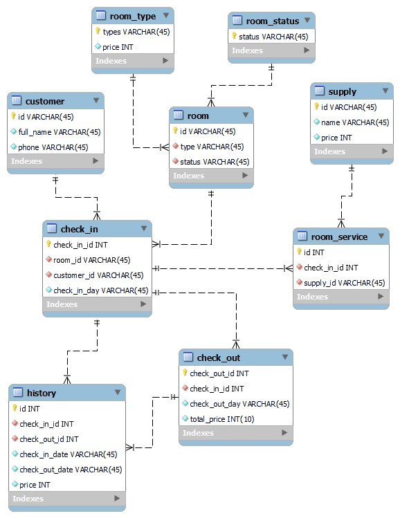
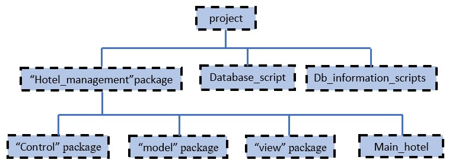
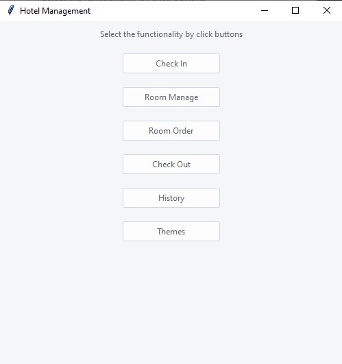
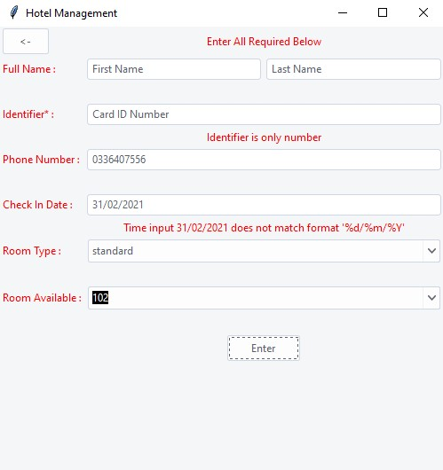
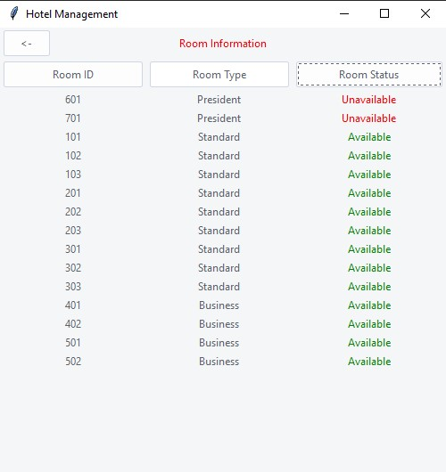
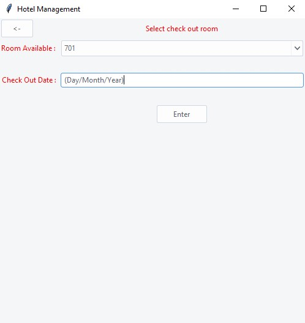
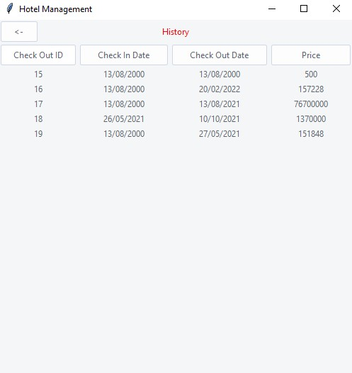
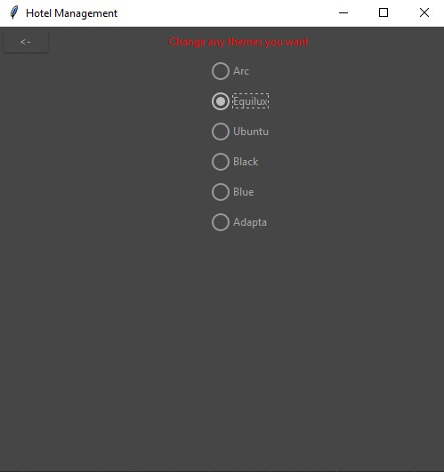

<div align="center">

Advanced Programming with Python

# **Report Project: HOTEL MANAGEMENT SYSTEM**

&nbsp;

**Group: 8**

**University of Science and Technology of Hanoi**

May 2021

&nbsp; &nbsp;

## **Group members**

```
Lê Anh Tú

Đỗ Mạnh Thắng

Nguyễn Ngọc Khiêm

Nguyễn Văn Cường

Đặng Hoàng Phúc
``` 

 </div>

## **TABLE OF CONTENTS**

- [I/ Introduction](#intro)
    + [1. What is Hotel Management System](#intro1)
    + [2. Approaches](#intro2)
    + [3. Preparations](#intro3)
        * [a) Software and tools](#intro31)
        * [b) Modules](#intro32)

- [II/ Implementation](#implementation)
    + [1. Planing](#implementation1)
    + [2. Database schema](#implementation2)
        * [a) Relationship between tables](#implementation21)
        * [b) Tables functions](#implementation22)
    + [3. Project Architecture](#implementation3)
    + [4. Modules, Classes and Packages](#implementation4)
        * [a) Database Script](#implementation4a)
        * [a) Database Information Scripts](#implementation4b)
        * [a) Hotel Management](#implementation4c)

- [III/ Results](#results)
    + [1. Main Frame](#results1)
    + [2. Check in](#results2)
    + [3. Room manage](#results3)
    + [4. Room order](#results4)
    + [5. Check out](#results5)
    + [6. History](#results6)
    + [7. Themes](#results7)

- [IV/ Conclusion](#conclusion)

## I/ Introduction <a name="intro"></a>

### 1. What is Hotel Management System <a name="intro1"></a>

&ensp;&ensp;&ensp;We live in a world of high-tech solutions in every sphere - from finances to agriculture. Currently,
more and more travelers tend to book rooms and services online, so hotel owners should be prepared to cope with this
type of activity.

&ensp;&ensp;&ensp;In addition, hotel management systems are developed not only for customer interactions but for
improving the workflow in general. They help to monitor internal processes and provide high-quality services.

&ensp;&ensp;&ensp;Moreover, hotel management software is great for storing all the important details about your guests
in one place, and you can use this information for greeting the guests properly or offering them activities to their
taste. This is beneficial for both the company, and the hotel as it helps to boost guest's loyalty and gain more profit.

&ensp;&ensp;&ensp;As you can see, a hotel management system may become a great asset to the business, improving your
team's performance and helping to keep up with competitors.

### 2. Approaches <a name="intro2"></a>

&ensp;&ensp;&ensp;First, the program is designed with a convenient and easy-to-use interface, easy to look up,
minimizing unnecessary risks that manual room registration encounters, such as wrong check-in date, wrong service, etc.
One of the reasons that make our program valuable is our service. We are friendly, responsible and quick to respond.
Additionally, our program has open source that is free to use.

&ensp;&ensp;&ensp;Implementing the idea, our team developed a system to simplify the work of a manager. We have also
written functions that help managers handle customer transactions such as check-in, customer information entry, room
management, service order entry, payment entry and record keeping of incoming guests.

&ensp;&ensp;&ensp;The main aim of the entire activity is to automate the process of day to day activities of hotels like
room activities, admission of a new customer, assign a room according to customer's demand, checkout of a computer and
releasing the room and finally compute the bill etc.

### 3. Preparations <a name="intro3"></a>

#### a) Software and tools <a name="intro31"></a>

- OS: Windows 10
- Environment: Python 3.9
- Database: Mysql
- Storage: Github
- IDE: Pycharm, Visual Studio Code
- Software: Mysql Workbench, Mysql Server

#### b) Modules <a name="intro32"></a>

- tkinter
- ttkthemes
- mysql-connector
- datetime

## II/ Implementation <a name="implementation"></a>

### 1. Planing <a name="implementation1"></a>

&ensp;&ensp;&ensp;To implement this project, we came up with the idea of creating 6 functions that perform different
tasks of the hotel management system:

```
Check in:
    Name guest.
    Id guest.
    Room type and room number.
    Check out check in time.
    Enter the number of days in.
    
Room list (room status):
    Room name and room type.
    Room status.
    Show service taken from order service function.
    Sorting.
    
Order service:
    Room name.
    Service name.
    
Check out:
    Room and guest information.
    Room charge and service name.
    Pay by card or cash save to history function.
    Room reset.
    
History:
    Room name, guest name, service name. 
    Number of days.
    Sorting.
    Payment amount.
    
Themes:
    Changing background color.
    Changing appearance of widgets.
```

### 2. Database schema <a name="implementation2"></a>

&ensp;&ensp;&ensp;**Database** is an organized collection of structured information, or data, typically stored
electronically in our system. The Diagram below is drawn to show the structure of the database. By using database
diagrams we can create and modify tables, columns, relationships, and keys. Additionally, you can modify indexes and
constraints. Most importantly, the diagram shows the relationships between tables that is the key for ideas.



#### a) Relationship between tables <a name="implementation21"></a>

+ Tables with one-to-one relationship: &quot;customer&quot;, &quot;room\_type&quot;, &quot;room\_status&quot;,
  &quot;supply&quot;.
+ Tables with one-to-many relationship: &quot;room\_service&quot;, &quot;history&quot;.
+ Tables with many-to-many relationship: &quot;room&quot;, &quot;check\_in&quot;, &quot;check\_out&quot;.

#### b) Tables functions <a name="implementation22"></a>

- Customer: key information of a customer.
- Room\_type: type and price of each room.
- Room\_Status: room unavailable or available.
- Room: data of all rooms.
- Supply: the menu to order.
- Room\_service: save room information
- Check\_in: contains customer information and choices.
- Check\_out: Customer&#39;s Invoice.
- History: Data warehouse of hotel management system.

### 3. Project Architecture <a name="implementation3"></a>

&ensp;&ensp;&ensp;MVC (Model-View-Controller) is an architectural design pattern that uses a separation of concerns to
better application organization. Model, View, and Controller are the three components that make up an interactive
application. It separates business data (Models) from user interfaces (Views), with a third component (Controllers) in
charge of logic, user input, and coordinating both the models and views. The goal of MVC is to help structure the
separate concerns of an application into three parts:

- Model is responsible for managing the data of the application. From the controller module, it receives user input.
  <br/><br/>
- The controller reacts to user input and interacts with the data model objects. The controller receives the input,
  validates it if necessary, and then sends it to the model.
  <br/><br/>
- View means a presentation of the model in a particular format, which would normally be a GUI.


### 4. Modules, Classes and Packages <a name="implementation4"></a>

&ensp;&ensp;&ensp;Apply the above criteria, we divide it into various small sections to facilitate easy processing as
figure below:



> &ensp;&ensp;&ensp;As can be seen, the project is separated into three packages: the codes are in package "hotel management",
> and there are two files with the aim of setting up a database: "database script" and "db information scripts."

> &ensp;&ensp;&ensp;Inside Hotel_management, there is 3 more packages: “control”, “model”, “view” and file “main_hotel”.

#### a) Database Script <a name="implementation4a"></a>

&ensp;&ensp;&ensp; The Database scripts is a series of command line scripts which will create, erase, restore and merge
databases.

#### b)  Database Information Scripts <a name="implementation4b"></a>

&ensp;&ensp;&ensp; As soon as the database is created, this file will be run with the task of generating information for
the database, such as entering room information, type of food, and so on.

#### c) Hotel Management <a name="implementation4c"></a>

> The hotel management system's entire python codes

- Control: As discussed above, controller.py is responsible for interacting and inspecting user data. To do this, the
  controller must contain methods such as input_dob() that force the user to enter the corresponding user date of birth.
  <br/><br/>
- Model: Python module that deals with the database. It is responsible for the CRUD methods and connects the database to
  the interface.
  <br/><br/>
- View: View is the most difficult element because it takes extensive understanding of GUI and OOP. At this package. We
  divide into two main parts using the divide-to-conquer method:

    + Root file: Root is responsible for creating and setting information for the main window. Most importantly, it also
      takes care of switching between frames during the program by using switch_frames().

    + Other files: They're frames made by inheriting from the ttk module Frame class. These frames will show the user
      with options, requests, and messages, functional buttons and will be switched by root.
      <br/><br/>
- Main_hotel: The file which call the root file and generating root object.

## III/. Results <a name="results"></a>

### 1. Main Frame <a name="results1"></a>



> &ensp;&ensp;&ensp;The main frame with five functionalities to select: check in, room manage, room order, check out, history.

### 2. Check In <a name="results2"></a>



> &ensp;&ensp;&ensp;The first five entries, user can enter information of either customers, and the
> day the customer starts renting the room.

> &ensp;&ensp;&ensp;Note: The user must enter the correct required format otherwise a red error
> will appear in each empty space.

> &ensp;&ensp;&ensp;On last two widgets, users can choose the room type and availability as required
> by the customer.

### 3. Room Manage <a name="results3"></a>



> &ensp;&ensp;&ensp;Display a list of available or unavailable room statuses (in this case values is sorted by sort button).

### 4. Room Order <a name="results4"></a>


> &ensp;&ensp;&ensp;Based on the order of the customer who is renting the room, the user selects
> the type of item, and the quantity provided to that customer.

### 5. Check Out <a name="results5"></a>



> &ensp;&ensp;&ensp;Select the room and fill in the customer&#39;s check-out date, thereby
> calculating the customer&#39;s invoice.

### 6. History <a name="results6"></a>



> &ensp;&ensp;&ensp;After each customer check-out, automatically store the hotel room rental
> period, and the amount paid by the customer.

### 7. Themes <a name="results7"></a>



> &ensp;&ensp;&ensp;If you are a person who likes uniqueness and creativity. This function can give you some
> satisfaction when changing the appearance of windows as well as widgets

## IV/ Conclusion <a name="conclusion"></a>

&ensp;&ensp;&ensp;We have almost completed program at a good level with the functions, inputs, outputs and user
interface are clear and simple but effective. Besides, we still haven't done the job perfectly, the program still lacks
the billing, setting system, and other features.

&ensp;&ensp;&ensp;Working on a real project together with teammates, we learned a lot of valuable things like
partnership, planning and task division. We studied extensively during and be aware of the implementation process's
requirements.